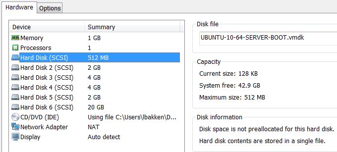
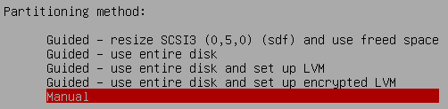
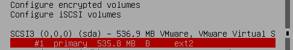
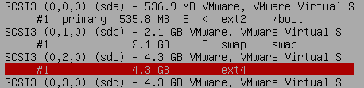
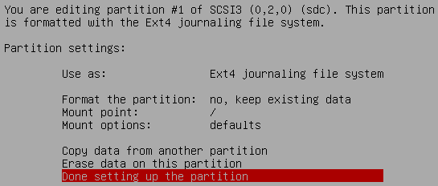
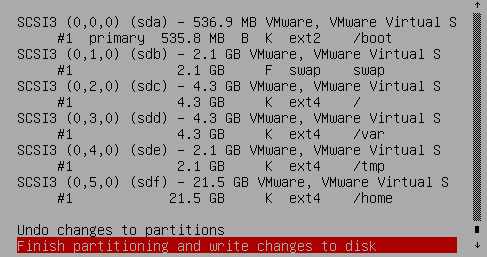

Partitions - A Thing Of The Past (Part 2)
=========================================

While searching for solutions to the "online root resize" issue, I came across the [following blog
post](http://echenh.blogspot.com/2010/04/how-to-extend-lvm-on-vmware-guest-os.html), which contained a comment suggesting that a
partition-less/LVM-less disk enabled the online expansion of any file system:

> Going to a LVM/partition-less setup reduces expansion to 3 steps and we don't need to take the VM OS offline!
>
> 1. Increase size of VMDK
> 2. Inside the VM, OS, rescan the scsi drive with: `echo 1 >/sys/class/scsi_device//rescan; dmesg` (dmesg will check that you drive size has grown)
> 3. `resize2fs`
> 
> Our current disk arrangement has 3 VM HD devices
>
> 0. small device (100M) with a single BOOT partition
> 1. entire device is /
> 2. entire device is SWAP

In addition, there is an interesting [discussion on
stackexchange.com](http://unix.stackexchange.com/questions/14010/the-merits-of-a-partitionless-filesystem) concerning partitionless file systems.
[This article](http://v-reality.info/2010/06/working-with-linux-volumes-n-vsphere/) also outlines using partitionless file systems.

With this in mind, there are two ways to proceed:

1. Convert an existing installation to one using partitionless drives.
2. Install from scratch using several drives.

I don't know of a single Linux distro that supports partitionless file systems out of the box. I have had some success by formatting the drives
using the [System Rescue CD](http://www.sysresccd.org/Download) and then performing an Ubuntu installation. I'll go through the steps here.

##VM Setup##

In VMWare Workstation, I set up a VM with the following settings, using thin provisioned disks:

The disks, in order from the top, have the following properties:

<table>
  <thead>
    <tr><th>Name</th><th>SCSI [BUS:ID]</th><th>Size</th><th>Device</th><th>Mount</th></tr>
  </thead>
  <tbody>
    <tr><td>Hard Disk</td><td>[0:0]</td><td>512MB</td> <td><pre>/dev/sda</pre></td> <td><pre>/boot</pre></td></tr>
    <tr><td>Hard Disk 2</td><td>[0:1]</td><td>2GB</td> <td><pre>/dev/sdb</pre></td> <td><pre>swap</pre></td></tr>
    <tr><td>Hard Disk 3</td><td>[0:2]</td><td>4GB</td> <td><pre>/dev/sdc</pre></td> <td><pre>/</pre></td></tr>
    <tr><td>Hard Disk 4</td><td>[0:3]</td><td>4GB</td> <td><pre>/dev/sdd</pre></td> <td><pre>/var</pre></td></tr>
    <tr><td>Hard Disk 5</td><td>[0:4]</td><td>2GB</td> <td><pre>/dev/sde</pre></td> <td><pre>/tmp</pre></td></tr>
    <tr><td>Hard Disk 6</td><td>[0:5]</td><td>20GB</td><td><pre>/dev/sdf</pre></td> <td><pre>/home</pre></td></tr>
  </tbody>
</table>

Set up the CD to boot from the System Rescue CD iso image. Power on your VM and you'll soon be at a prompt to do some work. Since the boot drive
isn't ever going to be expanded, we can create a primary partition and `ext2` filesystem on it. Start the partiton at sector 2048 and end it at
the end of the disk (512MB, 536870912 bytes, 1048576 512-byte sectors).

* `parted -s /dev/sda 'mklabel msdos'` creates an MBR partition table on SCSI disk [0:0]
* `parted -s /dev/sda 'u s mkpart primary 2048 1048575'` creates the first primary partition starting at sector 2048
* `parted -s /dev/sda 'set 1 boot on'` marks the first partition as bootable
* `parted -s /dev/sda 'u s p'` prints out the partition table in sectors

Terminal session:

    root@sysresccd /root % parted -s /dev/sda 'mklabel msdos'
    root@sysresccd /root % parted -s /dev/sda 'u s mkpart primary 2048 1048575'
    root@sysresccd /root % parted -s /dev/sda 'set 1 boot on'
    root@sysresccd /root % parted -s /dev/sda 'u s p'
    Model: VMware, VMware Virtual S (scsi)
    Disk /dev/sda: 1048576s
    Sector size (logical/physical): 512B/512B
    Partition Table: msdos
    Disk Flags:

    Number  Start  End       Size      Type     File system  Flags
    1      2048s  1048575s  1046528s  primary               boot

This command formats the first partition with the `ext2` file system and labels it 'boot':

    root@sysresccd /root % mkfs -t ext2 -L boot /dev/sda1
    mke2fs 1.42.6 (21-Sep-2012)
    Filesystem label=boot
    OS type: Linux
    ...
    ...

Now, create ext4 filesystems on the rest of the drives, using `/dev/sdb` for swap:

    root@sysresccd /root % mkswap /dev/sdb
    mkswap: /dev/sdb: warning: don't erase bootbits sectors
            on whole disk. Use -f to force.
    Setting up swapspace version 1, size = 2097148 KiB
    no label, UUID=1ceb754a-58e7-414c-8ca5-0e7fed04ddf7

    root@sysresccd /root % mkfs -t ext4 -L root /dev/sdc
    mke2fs 1.42.6 (21-Sep-2012)
    /dev/sdc is entire device, not just one partition!
    Proceed anyway? (y,n) y
    Filesystem label=root
    OS type: Linux
    ...
    ...
    root@sysresccd /root % mkfs -t ext4 -L var /dev/sdd
    ...
    root@sysresccd /root % mkfs -t ext4 -L tmp /dev/sde
    ...
    root@sysresccd /root % mkfs -t ext4 -L home /dev/sdf
    ...

When done, `parted -l` will show you your newly formatted disks. Shutdown the system and switch the CD-ROM to use your Ubuntu install CD. I'm
going to install 10.04LTS, but these instructions should work with Ubuntu 12 as well. Don't use the "easy install" feature if given the option!
Also, you may have to modify your VM's BIOS to boot from the CD before attempting to boot from the disk.

Continue with the installation until you reach the partitioning step, then choose "Manual":

Scroll down to select your boot disk and hit Enter:

Use the following settings. The important ones are "keep existing data" and "Mount point: `/boot`"

Choose "Done setting up the partition", and move on to your root file system:

Use the following settings, choosing to keep existing data and use `/` as your mount point ...

Continue in a similar manner until all of your disks are set up:

Continue with the installation and boot up. You can verify your disks using these commands.

`blkid` prints out labels and UUIDs for devices in the system:

    root@ubuntu:~# blkid
    /dev/sda1: LABEL="boot" UUID="752dff66-4b88-40bc-bf71-e1a838a65a89" TYPE="ext2"
    /dev/sdb: UUID="1ceb754a-58e7-414c-8ca5-0e7fed04ddf7" TYPE="swap"
    /dev/sdc: LABEL="root" UUID="ba00143f-171c-4df9-a720-1d8d56fa063f" TYPE="ext4"
    /dev/sdd: LABEL="var" UUID="cf9885d4-33d0-4ec1-ab87-4313ad5a762c" TYPE="ext4"
    /dev/sde: LABEL="tmp" UUID="499c55af-509e-469b-80d1-1d699bb6573b" TYPE="ext4"
    /dev/sdf: LABEL="home" UUID="13c7ce1c-ef90-4654-bf69-c90fd60133e9" TYPE="ext4"

This will print non-comment lines out of `/etc/fstab`, showing that the UUIDs are all set for your disks:

    root@ubuntu:~# grep -v '^#' /etc/fstab
    proc            /proc           proc    nodev,noexec,nosuid 0       0
    UUID=ba00143f-171c-4df9-a720-1d8d56fa063f /               ext4    errors=remount-ro 0       1
    UUID=752dff66-4b88-40bc-bf71-e1a838a65a89 /boot           ext2    defaults        0       2
    UUID=13c7ce1c-ef90-4654-bf69-c90fd60133e9 /home           ext4    defaults        0       2
    UUID=499c55af-509e-469b-80d1-1d699bb6573b /tmp            ext4    defaults        0       2
    UUID=cf9885d4-33d0-4ec1-ab87-4313ad5a762c /var            ext4    defaults        0       2
    UUID=1ceb754a-58e7-414c-8ca5-0e7fed04ddf7 none            swap    sw              0       0
    /dev/fd0        /media/floppy0  auto    rw,user,noauto,exec,utf8 0       0

This shows how your disks are mounted:

    root@ubuntu:~# mount | fgrep /dev/sd
    /dev/sdc on / type ext4 (rw,errors=remount-ro)
    /dev/sda1 on /boot type ext2 (rw)
    /dev/sdd on /var type ext4 (rw)
    /dev/sde on /tmp type ext4 (rw)
    /dev/sdf on /home type ext4 (rw)

Also note that since you're using thin provisioned disks, the actual space taken up on your host machine is much smaller:

    $ dir *.vmdk | Format-Table -Property Name,@{Name="MB";Expression={'{0:N0}' -f ($_.Length/1Mb)}} -AutoSize

    Name                          MB
    ----                          --
    UBUNTU-10-64-SERVER-BOOT.vmdk 37
    UBUNTU-10-64-SERVER-HOME.vmdk 8
    UBUNTU-10-64-SERVER-ROOT.vmdk 697
    UBUNTU-10-64-SERVER-SWAP.vmdk 0
    UBUNTU-10-64-SERVER-TMP.vmdk  2
    UBUNTU-10-64-SERVER-VAR.vmdk  352
    UBUNTU-10-64-SERVER.vmdk      1

In [Part 3](/2013/01/29/partitions-thing-of-the-past-3.html), I'll show how to migrate from a standard Linux setup to a partitionless one
without loss of data.
