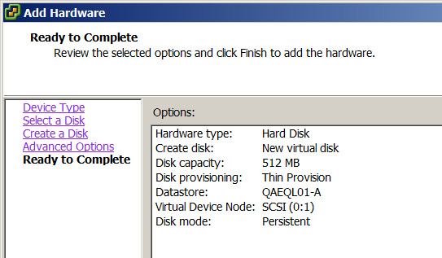
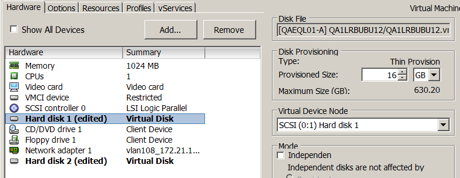
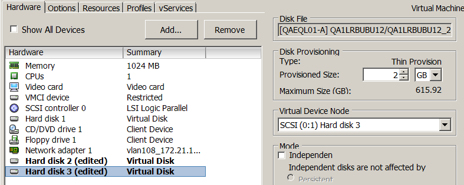
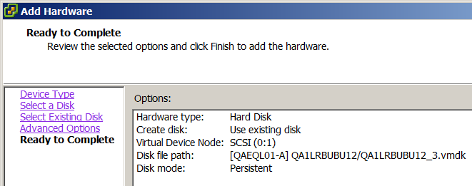
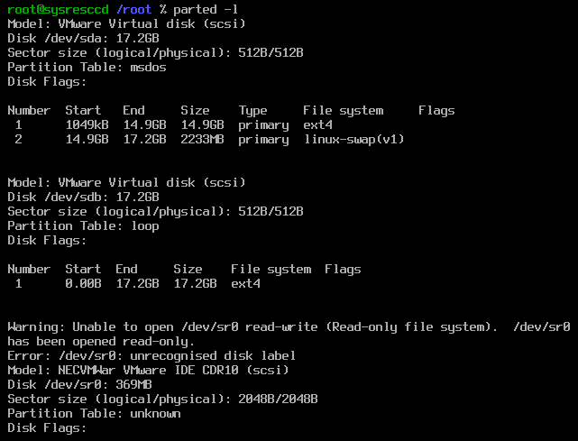
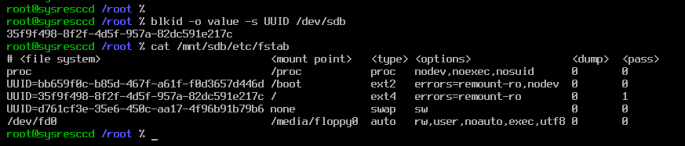
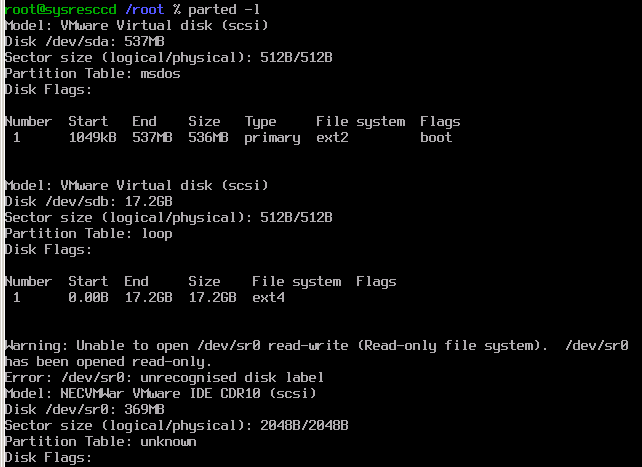
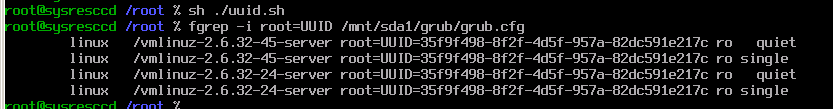
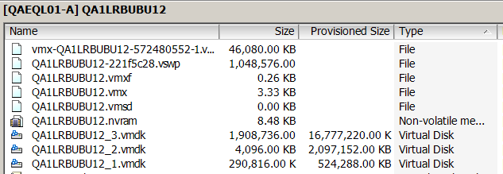

<!-- vim:fo=tq:tw=144:syntax=off:sw=2:ts=2:
-->

Here, I'll start with a standard Linux disk setup and will show the steps required to migrate to a partitionless one consisting of three disks -
one for `/boot`, one for swap and one for `/`. Extending this example to add other drives for `/var`, `/tmp` and `/home` is left to the reader.

First, here's the partition scheme of my VM running Ubuntu 10.04, in 512-byte sectors. Primary partition #1 is for the `/` file system, and also
has the MBR with grub installed:

    root@ubuntu:~# parted -s /dev/sda 'u s p'
    Model: VMware Virtual disk (scsi)
    Disk /dev/sda: 33554432s
    Sector size (logical/physical): 512B/512B
    Partition Table: msdos

    Number  Start      End        Size       Type     File system     Flags
    1      2048s      29190143s  29188096s  primary  ext4            boot
    2      29190144s  33552383s  4362240s   primary  linux-swap(v1)

#Step 1: Add disk for boot data and move existing boot partition to new disk#

Add 512MB SCSI disk 0:1 in VMWare vSphere client:

Use `rescan-scsi-bus.sh` to scan drives. `rescan-scsi-bus.sh` requires that the `scsitools` package be installed and can be downloaded from
`http://rescan-scsi-bus.sh` (neat huh?)

    root@ubuntu:~# ./rescan-scsi-bus.sh
    Host adapter 0 (ata_piix) found.
    Host adapter 1 (ata_piix) found.
    Host adapter 2 (mptspi) found.
    Scanning SCSI subsystem for new devices
    Scanning host 0 for  SCSI target IDs  0 1 2 3 4 5 6 7, all LUNs
    Scanning host 1 for  SCSI target IDs  0 1 2 3 4 5 6 7, all LUNs
    Scanning for device 1 0 0 0 ...
    OLD: Host: scsi1 Channel: 00 Id: 00 Lun: 00
          Vendor: NECVMWar Model: VMware IDE CDR10 Rev: 1.00
          Type:   CD-ROM                           ANSI SCSI revision: 05
    Scanning host 2 for  SCSI target IDs  0 1 2 3 4 5 6 7, all LUNs
    Scanning for device 2 0 0 0 ...
    OLD: Host: scsi2 Channel: 00 Id: 00 Lun: 00
          Vendor: VMware   Model: Virtual disk     Rev: 1.0
          Type:   Direct-Access                    ANSI SCSI revision: 02
    Scanning for device 2 0 1 0 ...
    NEW: Host: scsi2 Channel: 00 Id: 01 Lun: 00
          Vendor: VMware   Model: Virtual disk     Rev: 1.0
          Type:   Direct-Access                    ANSI SCSI revision: 02
    1 new device(s) found.
    0 device(s) removed.

The new drive is now `/dev/sdb`. The following commands will set it up:

    root@ubuntu:~# parted -s /dev/sdb 'mklabel msdos'                   # Creates MBR partition table
    root@ubuntu:~# parted -s /dev/sdb 'u s mkpart primary 2048 1048575' # Creates single primary partition
    root@ubuntu:~# parted -s /dev/sdb 'set 1 boot on'                   # Marks drive bootable

This command will turn _off_ the boot flag on the first drive (`/dev/sda`):

    root@ubuntu:~# parted -s /dev/sda 'set 1 boot off'

Create an `ext2` file system on the new drive's first partition (`/dev/sdb1`):

    root@ubuntu:~# mkfs -t ext2 -L boot /dev/sdb1
    mke2fs 1.41.11 (14-Mar-2010)
    Filesystem label=boot
    OS type: Linux
    ...
    ...

Add to `/etc/fstab`:

    root@ubuntu:~# cp /etc/fstab /etc/fstab.orig
    root@ubuntu:~# blkid -o value -s UUID /dev/sdb1
    bb659f0c-b85d-467f-a61f-f0d3657d446d

New fstab (added `/boot` line with the above UUID):

    # <file system>                           <mount point>   <type> <options>                <dump>  <pass>
    proc                                      /proc           proc   nodev,noexec,nosuid      0       0
    UUID=bb659f0c-b85d-467f-a61f-f0d3657d446d /boot           ext2   errors=remount-ro,nodev  0       0
    UUID=4a63db92-1b92-4b5c-bf29-31a2f8f7a875 /               ext4   errors=remount-ro        0       1
    UUID=e3d681e6-54d5-4851-b551-e3631394e2f8 none            swap   sw                       0       0
    /dev/fd0                                  /media/floppy0  auto   rw,user,noauto,exec,utf8 0       0

Mount and copy the existing `/boot` directory to the new drive:

    root@ubuntu:~# mount /dev/sdb1 /mnt
    root@ubuntu:~# tar -C /boot -cpf - . | tar -C /mnt -xpvf -

Unmount and remount as `/boot`:

    root@ubuntu:~# umount /mnt; mount /dev/sdb1 /boot

Install and update grub. Note: it is very important to run `update-grub` as it will update `/boot/grub/grub.cfg` with correct device UUIDs

    root@ubuntu:~# grub-install /dev/sdb
    Installation finished. No error reported.
    root@ubuntu:~# update-grub
    Generating grub.cfg ...
    Found linux image: /boot/vmlinuz-2.6.32-45-server
    Found initrd image: /boot/initrd.img-2.6.32-45-server
    Found linux image: /boot/vmlinuz-2.6.32-24-server
    Found initrd image: /boot/initrd.img-2.6.32-24-server
    Found memtest86+ image: /memtest86+.bin
    done

Unmount and move existing /boot out of the way:

    root@ubuntu:~# umount /boot
    root@ubuntu:~# mv /boot /boot.orig
    root@ubuntu:~# mkdir /boot

Shutdown VM. In vSphere client, swap disk settings so that new boot disk is SCSI 0:0 and prior disk is 0:1

Start VM and confirm:

    root@ubuntu:~# mount | fgrep sd
    /dev/sdb1 on / type ext4 (rw,errors=remount-ro)
    /dev/sda1 on /boot type ext2 (rw,nodev,errors=remount-ro)

    root@ubuntu:~# parted -l
    Model: VMware Virtual disk (scsi)
    Disk /dev/sda: 537MB
    Sector size (logical/physical): 512B/512B
    Partition Table: msdos

    Number  Start   End    Size   Type     File system  Flags
    1      1049kB  537MB  536MB  primary  ext2         boot

    Model: VMware Virtual disk (scsi)
    Disk /dev/sdb: 17.2GB
    Sector size (logical/physical): 512B/512B
    Partition Table: msdos

    Number  Start   End     Size    Type     File system     Flags
    1      1049kB  14.9GB  14.9GB  primary  ext4
    2      14.9GB  17.2GB  2233MB  primary  linux-swap(v1)

#Step 2: Move swap partition to its own disk#

Add 2GB SCSI disk 0:2 in vSphere client as above and use `rescan-scsi-bus.sh` to scan drives. The new drive is now `/dev/sdc`.

Set up the entire disk as swap space:

    root@ubuntu:~# mkswap -f /dev/sdc
    Setting up swapspace version 1, size = 2097148 KiB
    no label, UUID=d761cf3e-35e6-450c-aa17-4f96b91b79b6

Add to `/etc/fstab`:

    root@ubuntu:~# cp /etc/fstab /etc/fstab.orig1
    root@ubuntu:~# vi /etc/fstab

New fstab (modified the UUID in the 'swap' line):

    # <file system>                           <mount point>   <type> <options>                <dump>  <pass>
    proc                                      /proc           proc   nodev,noexec,nosuid      0       0
    UUID=bb659f0c-b85d-467f-a61f-f0d3657d446d /boot           ext2   errors=remount-ro,nodev  0       0
    UUID=4a63db92-1b92-4b5c-bf29-31a2f8f7a875 /               ext4   errors=remount-ro        0       1
    UUID=d761cf3e-35e6-450c-aa17-4f96b91b79b6 none            swap   sw                       0       0
    /dev/fd0                                  /media/floppy0  auto   rw,user,noauto,exec,utf8 0       0

Enable new swap, disable old:

    root@ubuntu:~# swapon -s
    Filename                                Type            Size    Used    Priority
    /dev/sdb2                               partition       2181112 0       -1
    root@ubuntu:~# swapon -a
    root@ubuntu:~# swapon -s
    Filename                                Type            Size    Used    Priority
    /dev/sdb2                               partition       2181112 0       -1
    /dev/sdc                                partition       2097144 0       -2
    root@ubuntu:~# swapoff /dev/sdb2
    root@ubuntu:~# swapon -s
    Filename                                Type            Size    Used    Priority
    /dev/sdc                                partition       2097144 0       -1

Shutdown VM and move SCSI disk 0:2 to 0:1 and old 0:1 to 0:2. We want swap to be `/dev/sdb`.

Power on VM, confirm:

    root@ubuntu:~# parted -l
    Model: VMware Virtual disk (scsi)
    Disk /dev/sda: 537MB
    Sector size (logical/physical): 512B/512B
    Partition Table: msdos

    Number  Start   End    Size   Type     File system  Flags
    1      1049kB  537MB  536MB  primary  ext2         boot

    Model: VMware Virtual disk (scsi)
    Disk /dev/sdb: 2147MB
    Sector size (logical/physical): 512B/512B
    Partition Table: loop

    Number  Start  End     Size    File system     Flags
    1      0.00B  2147MB  2147MB  linux-swap(v1)

    Model: VMware Virtual disk (scsi)
    Disk /dev/sdc: 17.2GB
    Sector size (logical/physical): 512B/512B
    Partition Table: msdos

    Number  Start   End     Size    Type     File system     Flags
    1      1049kB  14.9GB  14.9GB  primary  ext4
    2      14.9GB  17.2GB  2233MB  primary  linux-swap(v1)

    root@ubuntu:~# swapon -s
    Filename                                Type            Size    Used    Priority
    /dev/sdb                                partition       2097144 0       -1

#Step 3: Move root file system to its own disk#

Add 16GB SCSI disk 0:3 in vsphere client and use `rescan-scsi-bus.sh` to scan drives. Drive is now `/dev/sdd`.

Create file system. Note: it'll warn you about using the entire device, which is what we want:

    root@ubuntu:~# mkfs -t ext4 -L root /dev/sdd
    mke2fs 1.41.11 (14-Mar-2010)
    /dev/sdd is entire device, not just one partition!
    Proceed anyway? (y,n) y
    Filesystem label=root
    OS type: Linux
    ...
    ...

Shut down this VM. Create a VM that will run the [Linux System Rescue CD](http://www.sysresccd.org/Download) and edit VM settings to attach the
original disk (`QA1LRBUBU12.vmdk` in my case) as SCSI 0:0 (`/dev/sda`) and the newest disk (`QA1LRBUBU_3.vmdk`) as SCSI 0:1 (`/dev/sdb`):

Power on the System Rescue VM and confirm disks:

Here you will make mount points and copy files from old root to new root:

    root@ubuntu:~# mkdir /mnt/sda1
    root@ubuntu:~# mkdir /mnt/sdb
    root@ubuntu:~# mount /dev/sda1 /mnt/sda1
    root@ubuntu:~# mount /dev/sdb /mnt/sdb
    root@ubuntu:~# tar -C /mnt/sda1 -cpf - . | tar -C /mnt/sdb -xpf -

Edit `/mnt/sdb/etc/fstab` to make the `/dev/sdb` disk the root disk. The ` >> /mnt/sdb/etc/fstab` will make your life easier as it will append
the new UUID to the end of the fstab and then you just need to move it around with your text editor:

    root@ubuntu:~# cp /mnt/sdb/etc/fstab /mnt/sdb/etc/fstab.orig2
    root@ubuntu:~# blkid -o value -s UUID /dev/sdb >> /mnt/sdb/etc/fstab
    root@ubuntu:~# vi /mnt/sdb/etc/fstab

New fstab (the UUID in the / line changed):

Power off the System Rescue VM and detach the disks.  Attach the new boot disk (`QA1LRBUBU12_1.vmdk`) as 0:0 (`/dev/sda`) and the new root file
system disk (`QA1LRBUBU12_3`.vmdk) as 0:1 (`/dev/sdb`). Power on the System Rescue VM and ensure you have the right disks attached:

We need to update the UUID of the root disk in grub's configuration. There's no easy way to do this other than to replace UUID values in the
grub configuration file:

    root@ubuntu:~# mkdir /mnt/sda1
    root@ubuntu:~# mkdir /mnt/sdb
    root@ubuntu:~# mount /dev/sda1 /mnt/sda1 # this is the new boot disk
    root@ubuntu:~# mount /dev/sdb /mnt/sdb   # this is the new root file system disk

The `/mnt/sda1/grub/grub.cfg` file will contain the UUID of the *old* root disk, and we need to replace it with the new UUID:

    root@ubuntu:~# fgrep -i root=UUID /mnt/sda1/grub/grub.cfg > uuid.sh
    root@ubuntu:~# blkid -o value -s UUID /dev/sdb >> uuid.sh
    root@ubuntu:~# vi uuid.sh

Edit uuid.sh to run this command:

    sed -i.bak 's/OLD-UUID/NEW-UUID/g' /mnt/sda1/grub/grub.cfg

Then, run the command and confirm

Power off the System Rescue VM and detach all disks. In original VM detach the original disk which is SCSI 0:2 and move SCSI 0:3 to 0:2

Power on original VM and confirm. We should also re-run "update-grub" to ensure that grub.cfg is the auto-generated version. Then ... DONE!

    root@ubuntu:~# parted -l
    Model: VMware Virtual disk (scsi)
    Disk /dev/sda: 537MB
    Sector size (logical/physical): 512B/512B
    Partition Table: msdos

    Number  Start   End    Size   Type     File system  Flags
    1      1049kB  537MB  536MB  primary  ext2         boot

    Model: VMware Virtual disk (scsi)
    Disk /dev/sdb: 2147MB
    Sector size (logical/physical): 512B/512B
    Partition Table: loop

    Number  Start  End     Size    File system     Flags
    1      0.00B  2147MB  2147MB  linux-swap(v1)

    Model: VMware Virtual disk (scsi)
    Disk /dev/sdc: 17.2GB
    Sector size (logical/physical): 512B/512B
    Partition Table: loop

    Number  Start  End     Size    File system  Flags
    1      0.00B  17.2GB  17.2GB  ext4

    root@ubuntu:~# swapon -s
    Filename                                Type            Size    Used    Priority
    /dev/sdb                                partition       2097144 0       -1
    root@ubuntu:~# update-grub
    Generating grub.cfg ...
    Found linux image: /boot/vmlinuz-2.6.32-45-server
    Found initrd image: /boot/initrd.img-2.6.32-45-server
    Found linux image: /boot/vmlinuz-2.6.32-24-server
    Found initrd image: /boot/initrd.img-2.6.32-24-server
    Found memtest86+ image: /memtest86+.bin
    done

Also, note the difference in physical size vs. provisioned size of the disks:

In the next part of this series, I'll look into the LVM feature set and how using partitionless disks in a virtualized environment eliminates
the need for LVM entirely.
